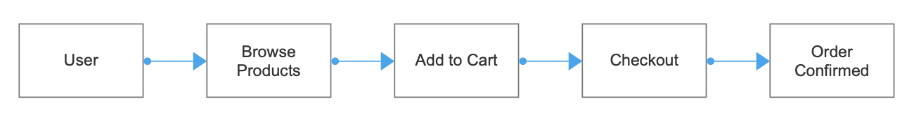

# Business Analysis Tools and Process Diagram Templates Knowledge Documentation
This document shows how different BA tools and process diagrams support our e-commerce project. For example, we can use Jira to track user stories, Draw.io for our business process hierarchy, and Figma to show UI mockups. These tools make requirements visible and understandable for the whole team.
## 1. Common BA Tools

- 1.1 Requirements & Backlog Management
  - Jira
	- Use: Manage user stories, epics, sprints.
	- Example: Our BA user stories (e.g., “Add to Cart”) can be tracked as Jira tickets with status (To Do / In Progress / Done).
  - Confluence
	- Use: Central place for documentation, requirements, and meeting notes.
	- Example: Store BA documents like personas, business processes, and acceptance criteria.

- 1.2 Modeling & Diagramming
  - Lucidchart / Draw.io
	- Use: Create process flows, BPMN, ER diagrams.
	- Example: E-commerce flow: Browse → Cart → Checkout → Confirm Order.
  - Figma / Balsamiq
	- Use: Create mockups and wireframes.
	- Example: Login screen, product listing page, shopping cart screen.

- 1.3 Analysis & Data Tools
  - Excel / Google Sheets
	- Use: Requirement traceability matrix, prioritization, grooming.
	- Example: Map user stories to requirements and test cases.
  - Power BI / Tableau (advanced)
	- Use: Visualize business data, dashboards.
	- Example: Show order statistics, product popularity.
## 2. Process Diagrams (Samples)
- 2.1 High-Level Business Process Flow (E-commerce MVP)

- 2.2 Swimlane Diagram (Simplified)

![Swimlane Diagram Flow] (images/Swimlane_Diagram.png)

- 2.3 Mockup Samples (Tools: Figma / Balsamiq)
  - Login Screen – Email + password fields + “Register” link.
  - Product Listing – Grid of product cards with name, price, stock, “Add to Cart” button.
  - Cart Page – List items, quantity field, “Checkout” button.
  - Order Confirmation – Order ID + summary of items.

 ## 3. Summary
- Tools like Jira, Confluence, Lucidchart, and Figma help a BA manage requirements, diagrams, and documentation.
- Process diagrams (flows, swimlanes, mockups) make requirements clear for developers and testers.
- For our project, we should:
  - Track user stories in Jira (or Excel if Jira not available).
  - Document BA artifacts in Confluence (or shared folder).
  - Use Draw.io for process flows.
  - Use Figma for screen mockups.
