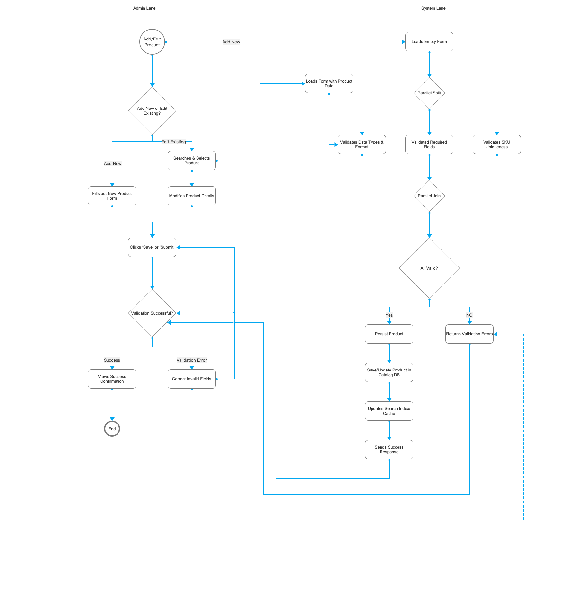

# 3. Process Flow / BPMN Diagrams

## Critical Flow 1: Checkout & Place Order
   - User → View Cart → Checkout → Confirm Order → System generates OrderId → Confirmation Page → Order saved in DB.

## Critical Flow 2: Admin Product Management
   - Admin → Add/Edit Product Form → Validate SKU & fields → Save → Product updated in catalog → Users see updated product list.

